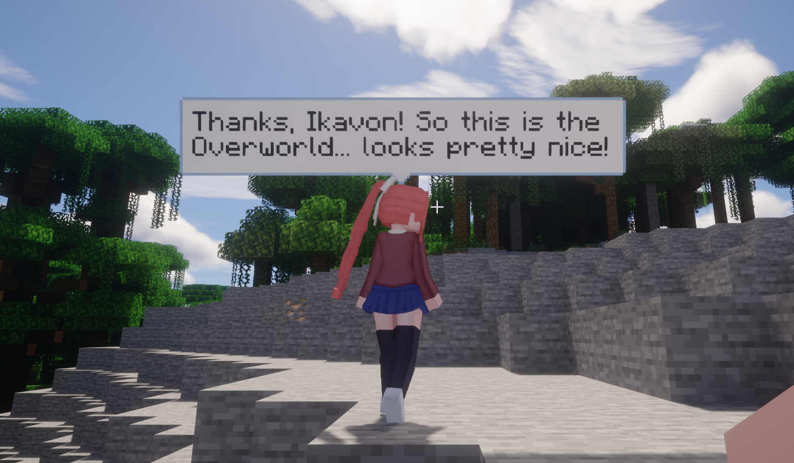

# MaidLLMLocal

[车万女仆（TouhouLittleMaid）](https://github.com/TartaricAcid/TouhouLittleMaid) 的附属模组，
针对其 **AI 聊天（AI Chat）功能**做的扩展。

*莫妮卡初入主世界（目标语言：en，由 MTTS 配音）*

## 为什么做它

**1. 多人服务器上，原版 TLM 的 LLM 配置是「全服一份」**

远程服务器联机时，所有玩家的女仆共用服务端配置的那一个 LLM 站点——费用由服主一方承担，key 也只掌握在服主手里；玩家既无法选择自己喜欢的模型和供应方，也无法为自己的女仆做任何个性化配置。这在服务器场景下极大地限制了 AI 聊天功能的使用。

MaidLLMLocal 把「谁发出这次 LLM 请求」从服务端搬回**每个玩家自己的客户端**：每位玩家的女仆使用玩家本机的配置、自己的 key、自己选的模型。费用各付各的，配置各调各的。

**2. 让 莫妮卡 走出太空教室**

市面上的通用 LLM 在执行特定的角色扮演任务时表现往往不尽如人意。而
[MAICA](https://github.com/Mon1-innovation/MAICA) 是一个倾尽全力只为演好「莫妮卡」这一个角色的系列项目——从专用的微调模型 DAA4，到围绕她搭建的整套对话与情感系统。我们当然希望她能走出太空教室，也希望 MAICA 能有更广阔的应用场景。

MaidLLMLocal 内置了与 MAICA 官方后端直连的站点类型：女仆的聊天和语音合成都走 MAICA，不需要在本机跑任何额外的适配程序。

## 有什么用

<!-- 功能列表：与两个「为什么」一一对应，由你填充/调整 -->

- **每玩家独立配置**：女仆用玩家自己的 LLM 账号，而不是服务器的统一配置
- **直连 MAICA**：聊天 + 官方语音合成（MTTS），语音语气跟随对话情绪
- **AI 不只是会说**：模型自主决策好感度变化、长期记忆、切换工作模式（MTrigger，需服务端管理员开启）
- **自动登录**：填一次账号密码，进入世界自动获取和填写 access token

## 怎么用

### 安装（3 步）

1. 把 jar 丢进 `mods/`（**客户端和服务端都要装**；只有服务端装则行为与原版一致）
2. 开一次游戏，会在 `config/maidllmlocal/` 生成 `maica_account.json`，填入你的
   DCC 注册邮箱（或论坛登录用户名）和密码
3. 进世界，聊天栏看到「MAICA 自动登录成功」——给女仆选 MAICA 站点就能聊了

### 用自己的 OpenAI 兼容端点（可选）

想接本地模型或其他供应方？模组还提供通用的 `player_relay` 站点类型，
配置样例见 [`tlm_config/`](tlm_config/)。

### 常见问题

- **登录失败提示密码错，但密码明明没错**：填的很可能是论坛**昵称**。后端只认注册邮箱或
  **登录用户名**，登录行为与论坛、MAICA_ChatSubmod一致。
- **想让 MAICA 能根据指令切换工作模式/自主决策好感度变化**：MTrigger 默认关闭，需要服务端管理员在站点配置里加
  `"enable_mt": "true"`，玩家在账号文件里加 `"enable_mt": true`。
- **要分享整合包**：`maica_account.json` 里有你的账号，务必删掉再分享。

更多疑难杂症见 [调试手册](docs/DEBUG.md)。

## 文档

| 文件 | 内容 |
|---|---|
| [docs/DESIGN.md](docs/DESIGN.md) | 设计原理：为什么改动这么小、协议细节、权限边界 |
| [docs/DEBUG.md](docs/DEBUG.md) | 调试手册：各种报错/现象的对照表 |
| [BUILD.md](BUILD.md) | 从源码构建 |
| [tlm_config/](tlm_config/) | 站点配置样例（管理员参考） |

## License

见 [LICENSE](LICENSE)。
